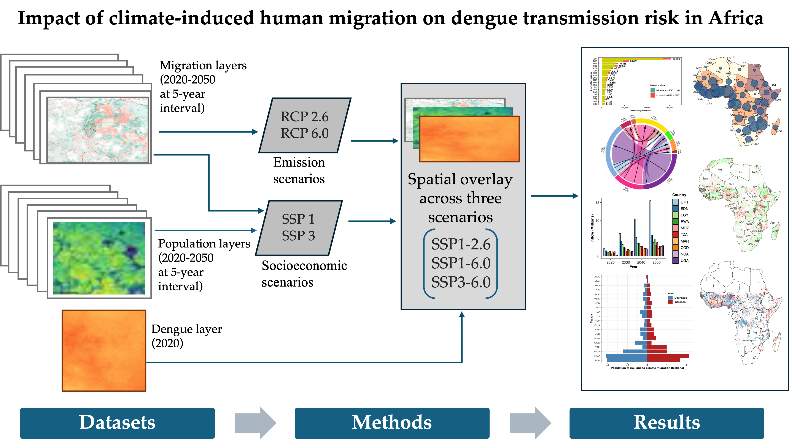

# Impact of climate-induced human migration on dengue transmission risk in Africa

# Abstract

Climate-induced human migration is becoming an important factor shaping dengue transmission across Africa. Using continent-wide projections of climate-related migration and population change under multiple development and emissions scenarios through 2050, here we examine how internal and cross-border migration evolve across space and time, and how these shifts reshape population exposure to dengue risk. We find that by mid century, cross-border climate migration is projected to reach about 1.1 million people, while internal climate migration could rise to nearly 75 million. Internal migration is expected to concentrate people in cities, border areas, and climatically favorable regions, while cross-border movements redistribute populations across countries. These mobility patterns create conditions for dengue to spread into areas of Southern Africa with limited or no historical transmission, while further intensifying burdens in already endemic regions of West and East Africa. Overall, climate-induced migration is likely to become a major driver of future dengue risk, underscoring the need for proactive, migration-aware public health planning.

# Acknowledgments  

The authors acknowledge that this work is an initiative of the CLIMADE consortium. The Centre for Epidemic Response and Innovation and the Kwazulu-Natal Research Innovation and Sequencing Platform are supported in part by grants from the Rockefeller Foundation (HTH 017), the National Institute of Health USA (U01 AI151698) for the United World Antiviral Research Network, and the INFORM Africa project through the Institute of Human Virology Nigeria (U54 TW012041), Global Health EDCTP3 Joint Undertaking and its members and the Bill & Melinda Gates Foundation (101103171), European Union (EU) Horizon Europe Research and Innovation Programme (101046041), the Health Emergency Preparedness and Response Umbrella Program, managed by the World Bank Group (TF0B8412), the Medical Research Foundation (MRF-RG-ICCH-2022-100069), and the Wellcome Trust (228186/Z/23/Z). MUGK acknowledges funding from The Rockefeller Foundation (PC-2022-POP-005), Google, the Oxford Martin School Programmes in Pandemic Genomics & Digital Pandemic Preparedness, EU Horizon Europe programme project MOOD (874850), E4Warning (101086640), the Wellcome Trust (225288/Z/22/Z, 226052/Z/22/Z, and 228186/Z/23/Z), UK Research and Innovation (APP8583), and the Medical Research Foundation (MRF-RG-ICCH-2022-100069); and a Branco Weiss Fellowship. JL-HT is supported by a Yeotown Scholarship from New College at the University of Oxford. VC acknowledges funding from Horizon Europe (grants ESCAPE 101095619 and VERDI 101045989), and an EU Horizon 2020 grant (MOOD [H2020-874850, paper 874850]). The content and findings reported herein are the sole deductions, views, and responsibility of the researchers and do not necessarily reflect the official position and sentiments of the funding agencies.
